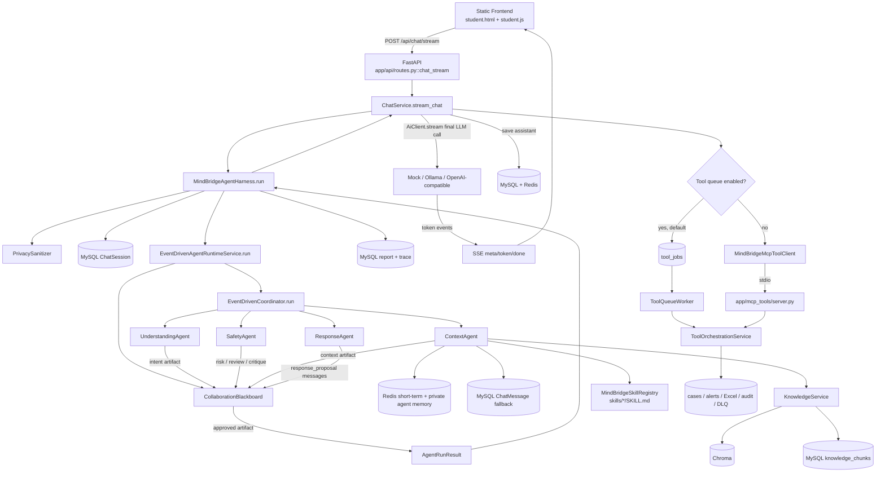
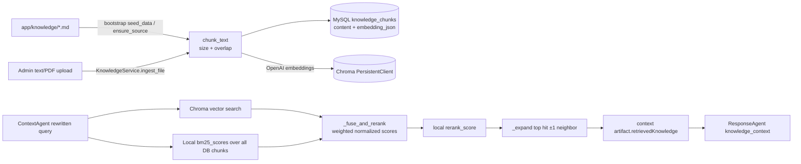

# Step 1 — Repository Audit / 项目结构审计

> 审计日期：2026-09-29  
> 审计范围：当前源码、配置、测试、脚本、内置知识库与静态前端。  
> 约束：本文件只描述现状与 Step 2 计划；本阶段未修改业务代码、Prompt、Agent、数据库、前端或测试。  
> 结论依据：以源码为准。仓库工作目录未暴露可用 Git 元数据，因此通过完整文件清单、只读源码检查和测试验证约束变更范围。

## Executive finding

当前真正的在线聊天链路是：FastAPI 路由创建 `ChatService`，`ChatService` 调用 `MindBridgeAgentHarness`；Harness 脱敏、解析会话并同步运行 `EventDrivenAgentRuntimeService`；Runtime 构建 Blackboard，由 `EventDrivenCoordinator` 以 claim-based 循环调度四个 worker Agent；最终产物不是回答文本，而是一组供最后一次 `AiClient.stream()` 调用使用的 messages。随后 Harness 保存报告/trace，HTTP 生成器流式调用 LLM、保存助手消息，并在流结束后入队工具任务（或在关闭队列时通过 MCP stdio 调用工具）。

因此 README 的“事件驱动多 Agent”基本属实，但有三个重要限定：

1. Agent 调度是单进程、同步、确定性循环，不是异步 actor 或外部消息队列。
2. `ResponseAgent` 只构造候选 Prompt/messages，不直接生成最终自然语言；真正的最终 LLM 调用在 `ChatService.stream_chat()`。
3. 默认 `TOOL_QUEUE_ENABLED=true` 时，报告后处理直接调用 `ToolOrchestrationService`，不经过 MCP；MCP 是关闭队列后的替代路径和独立工具服务入口。

## 1. Current Architecture



启动路径：`app/main.py::create_app()` 注册路由和静态目录；startup 调用 `create_schema()`、`seed_data()`，同步内置知识库并启动全局 `ToolQueueWorker`。配置由 `app/core/config.py::Settings` 从 `.env` 读取。数据库 session 来自 `app/core/database.py`。

## 2. Chat Execution Flow

真实调用链（函数与类均来自当前源码）：

```text
app/api/routes.py
  chat_stream(request, user, db)
    ├─ Basic Auth dependency: app/core/security.py::current_user()
    ├─ 禁止 ROLE_ADMIN 发起学生对话
    └─ StreamingResponse(ChatService(...).stream_chat(...))
        ↓
app/services/chat.py
  ChatService.stream_chat(user, request)
    ├─ MindBridgeAgentHarness.run()
    │   ↓
    │ app/agents/harness.py
    │   MindBridgeAgentHarness.run()
    │     ├─ PrivacySanitizer.sanitize()
    │     ├─ _resolve_session() → MySQL ChatSession
    │     ├─ app/agents/factory.py::create_agent_runtime()
    │     └─ EventDrivenAgentRuntimeService.run()
    │         ↓
    │       app/agents/event_driven_runtime.py
    │         ├─ 创建 AgentRuntimeServices
    │         ├─ 创建 CoordinatorAgent 与四个 worker Agent
    │         ├─ 创建 CollaborationBlackboard + TURN_STARTED
    │         └─ EventDrivenCoordinator.run(board)
    │             ↓
    │           app/agents/coordinator.py
    │             ├─ _ensure_root_task()
    │             ├─ _derive_missing_work()
    │             ├─ _claim_candidates()
    │             ├─ agent.decide() / agent.act()
    │             ├─ board.apply_turn_result()
    │             └─ _try_accept_final()
    │                 ↓
    │               intent/risk/context/response_proposal/safety_review artifacts
    │
    │     ├─ EventDrivenAgentRuntimeService._to_result()
    │     ├─ 保存 USER ChatMessage 到 MySQL + Redis
    │     ├─ _create_report()（所有非 CHAT intent，不只高风险）
    │     └─ AgentTraceService.save_run()
    │
    ├─ SSE meta
    ├─ AiClient.stream(outcome.response_messages)  ← 最终文本生成点
    ├─ 每个 token → SSE token
    ├─ save_assistant_message() → MySQL + Redis
    ├─ dispatch_tools()
    │   ├─ 默认：ToolQueueService.enqueue_report()
    │   └─ 队列关闭：MindBridgeMcpToolClient.handle_report()
    └─ SSE done
```

SSE 协议只包含 `meta`、`token`、`done`。`app/services/chat.py::sse()` 将对象编码为 `event: ...\ndata: ...\n\n`；`app/static/student.js::parseSse()` 解析响应 body 的 `ReadableStream`。这里没有使用浏览器 `EventSource`，因为请求是带 JSON body 的 POST。

异常/时序注意点：工具调度发生在 token 流和助手消息持久化之后；工具异常被记录 warning，不改变已经发给学生的回答。若客户端中途断流，生成器后半段（保存完整助手消息、工具调度、done）可能无法完成，这是现有行为风险。

## 3. Agent Runtime

### 3.1 Agent 清单

| Agent | 文件 | 输入 | 输出 | 职责 | 调 LLM | 调 Tool | 读 Blackboard | 修改共享 State |
|---|---|---|---|---|---|---|---|---|
| `CoordinatorAgent` | `app/agents/autonomous.py` | Blackboard（经 Coordinator 驱动） | root task；接受记录写入私有记忆 | 提供协调身份、根任务和 acceptance memory；不参与 registry claim | 否 | 否 | 间接 | 不直接；`EventDrivenCoordinator` 代其创建任务/接受 final |
| `UnderstandingAgent` | 同上 | open task、`model_input/user_input`、私有记忆 | `intent` artifact；发给 Coordinator 的 message | 分类 `CHAT/CONSULT/RISK`、topic | 是，失败后启发式回退 | 仅声明 `llm.intent` 权限，无真实 Tool dispatcher | 是 | 通过返回 `AgentTurnResult` 间接追加 artifact/message |
| `SafetyAgent` | 同上 | 输入、history 或候选 response artifact | `risk`、`safety_review` 或 `critique` artifact；override/revision event/task | 心理风险评估与候选 Prompt 安全审查 | 是（`PsychologicalAssessmentService`）；review 本身为规则检查 | 仅声明权限，无业务工具调用 | 是 | 间接追加 artifact/message/event/task |
| `ContextAgent` | 同上 | intent/risk、会话历史、当前输入 | `context` artifact（memory、RAG、skills） | Redis/MySQL memory、查询改写、RAG、Skill 聚合 | 是（查询改写、历史摘要） | 直接调用 memory/RAG/skills 服务；不是 MCP | 是 | 间接追加 context artifact/message |
| `ResponseAgent` | 同上 | intent/risk/context artifacts | `response_proposal` artifact（`list[AiMessage]`） | 构造 normal/support 模式 Prompt 与消息，不生成文本 | 否；最终 LLM 在 ChatService | 无 | 是 | 间接追加 proposal/message |

`AgentProfile.tool_permissions` 当前仅是元数据，没有统一执行器强制校验。`AgentModelRegistry` 可按 Agent 选择 provider/model；Coordinator 虽有 model profile，但当前不调用模型。

### 3.2 Coordinator 的真实职责

实现主体其实是 `app/agents/coordinator.py::EventDrivenCoordinator`，不是 `CoordinatorAgent.act()`。

| README 声称 | 真实实现 |
|---|---|
| 任务创建 | 已实现：根据缺失 artifact 创建固定语义的 task；Safety 也可创建 revision task |
| Agent 调度 | 已实现：registry capability 过滤 + `decide()` confidence + priority 排序；每轮同一 Agent 最多选一次 |
| Artifact 管理 | Blackboard 负责 append/query；Coordinator 只检查已存在/最新 artifact |
| 预算 | 已实现：`max_rounds`、`max_claims_per_round`、`max_claims_per_agent`；耗尽发布 `BUDGET_EXHAUSTED` |
| 冲突处理 | 部分实现：risk 取最高值，`SAFETY_OVERRIDE` 强制 HIGH；intent 取最新；没有一般化 artifact 合并、投票或 provenance 冲突算法 |
| 最终采纳 | 已实现：最新 response 必须有对应、approved 的 review 且 confidence 达阈值，随后 `FINAL_ACCEPTED` |

根任务 `task:root` 没有 required capability，且 Coordinator 不在 worker registry 中；worker 可对它 claim。由于 worker 产出的 task 在完成时关闭的是所执行的当前 task，root 常被首轮某个 worker 关闭。这不妨碍 `_derive_missing_work()` 继续创建专门任务，但说明它更像启动触发器而非完整依赖图根节点。

### 3.3 通信模型

当前是混合方式：

- 直接同步调用：Coordinator 在同一线程调用 `agent.decide()` / `agent.act()`。
- 事件驱动：所有状态变化记录为 `AgentEvent`，但没有独立 event bus/consumer。
- Blackboard：`CollaborationBlackboard` 是每次 replace 后产生新实例的共享快照。
- 共享 State：tasks/messages/artifacts/events/final id 集中在 Blackboard。
- 消息：`AgentMessage` 存入共享 mailbox，`messages_for()` 可过滤；当前消息主要用于 trace/可观测性，调度判断仍主要依赖 artifact。
- Artifact 发布：是业务协作核心，种类包括 `intent`、`risk`、`context`、`response_proposal`、`safety_review`、`critique`。
- 外部消息队列：Agent 间没有。`tool_jobs` 只服务回答后的工具执行。

## 4. Shared State

定义位于 `app/agents/events.py`：

```text
CollaborationBlackboard
├── turn_id                 # 通用基础设施
├── user_id                 # 可通用，但当前身份语义偏学生
├── session_id              # 通用基础设施
├── user_input              # 通用基础设施（原始输入）
├── model_input             # 通用基础设施（脱敏输入）
├── tasks: dict[id, AgentTask]
├── messages: tuple[AgentMessage]
├── artifacts: tuple[AgentArtifact]
├── events: tuple[AgentEvent]
└── final_artifact_id       # 通用基础设施

AgentTask
├── id/title/description/priority/status
├── required_capabilities/created_by/claimed_by
├── depends_on
└── metadata

AgentMessage
├── id/sender/recipient/content/task_id/kind
└── metadata

AgentArtifact
├── id/owner/kind/payload/confidence/task_id
└── metadata

AgentEvent
├── type/actor/task_id/artifact_id/message
└── metadata

AgentRunResult
├── intent                  # 当前心理业务枚举
├── risk_level              # 心理安全业务
├── assessment              # PsychologyAssessment，心理业务
├── retrieved_knowledge     # 可通用
├── response_messages       # 可通用
├── steps/memory_brief      # 可通用
└── collaboration_events/tasks/artifacts # 通用

PsychologyAssessment
├── emotion
├── emotion_score
├── risk
├── confidence
└── summary
```

`AgentTask.depends_on` 与 `TaskStatus.BLOCKED/TASK_RELEASED` 已定义，但当前 scheduler 没有依赖解析或 blocked/release 流程。`AgentClaim` 也定义但未成为 Blackboard 数据结构；实际 claim 直接更新 `AgentTask.claimed_by` 并追加 event。

通用 infrastructure：task/message/artifact/event/board 的大部分结构、优先级、claim、final acceptance、trace serialization。心理耦合：intent/risk/emotion/assessment 类型、Safety override 语义、Context 的校园心理查询、Response Prompt、report/tool plan。

## 5. RAG

### 5.1 导入与检索链



对应实现：

- 内置导入：`app/core/bootstrap.py::seed_data()` → `KnowledgeService.ensure_source()`。
- 管理员导入：`app/api/routes.py::ingest_knowledge()` / `ingest_file()`。
- PDF：`app/services/knowledge.py::extract_pdf()` (`pypdf`)。
- 切块：`chunk_text(content, size, overlap)`，字符窗口，不是语义切块。
- 数据表：`KnowledgeChunk` / `knowledge_chunks`，含 `embedding_json`。
- Chroma：`app/services/vector_store.py::ChromaKnowledgeStore`；`_embed()` 调 OpenAI-compatible `/embeddings`。
- BM25：`bm25_scores()`，运行时全表加载后本地计算。
- 融合：`KnowledgeService._fuse_and_rerank()`，分别 min-max normalize，再按配置权重加权。
- Reranker：`rerank_score()`，是本地词面组合（base + cosine/keyword + coverage + phrase），不是 cross-encoder/LLM reranker。
- Context expansion：只对排名第一的 chunk 取同 source 的前后各一块。
- 使用点：`ContextAgent.act()`；仅非 CHAT 或非 LOW 时检索。

README 与代码差异/限定：README 的 “local reranker” 正确，但应明确为启发式词面 reranker；fallback 实际仍是 BM25 → fusion（无 vector 时 BM25 权重归一）→ `rerank_score`，`hybrid_score` 只作为 reranker 的 lexical 分量。Chroma 不可用且 `knowledge_vector_required=false` 时静默回退；为 true 时抛错。

## 6. Skills

Skill Registry 是 `app/services/skills.py::MindBridgeSkillRegistry`：扫描项目根 `skills/*/SKILL.md`，解析自制的简单 YAML frontmatter（仅 `key: value`），验证目录名、description、`## Workflow` 和 handoff text template。

现有 Skills：

- `supportive_response_baseline`
- `high_risk_safety_plan`
- `anxiety_grounding_support`
- `sleep_routine_support`
- `academic_stress_planning`
- `referral_resource_guidance`
- `counselor_handoff_summary`

选择方式：`MindBridgeSkillLibrary.response_skill_names(intent, risk, text)` 使用确定性 if/关键词规则。CHAT 不选；HIGH 固定选 baseline + safety plan；其他咨询固定 baseline + referral，再按焦虑/睡眠/学业关键词追加。没有 embedding/LLM/registry capability 自动选择。

进入 LLM 的路径：`ContextAgent.act()` → `response_skill_context()` → `MindBridgeSkill.prompt_context()` → context artifact 的 `skillContext` → `ResponseAgent.act()` → `PromptTemplates.answer_system_prompt(..., skill_context)` → `ChatService` 最终 LLM 调用。

结论：回复类 Skills 对 Agent 的 task claim/调度没有直接影响，本质是经过确定性选择后的 Prompt injection/context composition；它们会真实影响最终 LLM 输入。`counselor_handoff_summary` 例外：其 fenced text template 被 Python 代码解析和变量替换，直接生成工具侧交接文本，不依赖 LLM。

## 7. MCP Tools

Server：`app/mcp_tools/server.py` 的 `FastMCP("mindbridge-python-tools")`，运行入口 `python -m app.mcp_tools.server`。Client：`app/services/mcp_client.py::MindBridgeMcpToolClient`，用 stdio 启动同一模块。

| Tool | 入口与参数 | 返回 | 调用方 | 心理专用 | 通用价值 |
|---|---|---|---|---|---|
| `mindbridge_excel_report` | `server.py`; `report_id:int` | success path 或 not found | MCP client；也可外部 MCP caller | 是 | “实体导出 Excel”模式可复用，当前实现/列不可直接复用 |
| `mindbridge_case_create` | `report_id:int` | caseId/reportId/status | MCP client | 是 | 幂等创建工作项模式可改造复用 |
| `mindbridge_alert_send` | `case_id:int` | status/channel/recipient/message | MCP client | 是 | 通知通道框架可改造复用 |
| `mindbridge_alert_ack` | `case_id, actor, note?` | case status/ack actor | 外部 MCP caller；`handle_report()` 不调用 | 是 | 通用确认工作流可改造复用 |
| `mindbridge_case_note_add` | `case_id, actor, note` | noteId/caseId | 外部 MCP caller；`handle_report()` 不调用 | 是 | 通用备注模式可改造复用 |
| `mindbridge_alert_notify` | `report_id:int` | alert record summary | legacy/外部 caller；`handle_report()` 不调用 | 是 | 通知模式可改造复用 |

所有工具最终调用 `app/services/tools.py::ToolOrchestrationService`。默认在线路径的 Tool Queue 直接调用该服务，绕过 MCP server/client。

## 8. Tool Queue

实现：`app/services/tool_queue.py`。

- 入队：`ToolQueueService.enqueue_report()` 创建幂等的 active/success job。
- 计划：所有报告 `EXCEL_REPORT`；MEDIUM/HIGH 再 `CASE_CREATE`；HIGH 再 `ALERT_SEND`，后者依赖 case job。
- Worker：startup 全局 `ToolQueueWorker`，daemon dispatcher 轮询 MySQL。
- 并发：Excel/case executor 与 email executor 分开；默认 1/2 workers。
- Retry：异常后按 `retry_delay * attempts` 线性延迟，直到 `max_attempts`。
- Rate Limit：`RateLimiter` 进程内 60 秒滑动窗口，只限 alert 类 job。
- Dead Letter：达到上限写 `dead_letter_records`，job 置 `DEAD`。
- Recovery：服务启动将遗留 RUNNING 恢复为 PENDING。
- Governance：`ToolGovernanceService` 会记录授权审计；策略完全以心理报告 risk 为条件。

可直接保留的机制：持久化 job、poll/claim 基础结构、依赖、重试、dead letter、启动恢复、独立 executor、审计记录思想。需要修改的绑定：`report_id`、`PsychologicalReport` 必须存在、风险级别授权、固定 enum、Excel/case/email worker 命名与 executor 路由、alert rate limit、payload 字段。当前领取 job 是逐条 commit 后 submit，没有数据库级 `SELECT FOR UPDATE/SKIP LOCKED` 或分布式 lease；多实例部署可能重复领取。

## 9. Memory

- MySQL：权威、长期数据。`chat_sessions`/`chat_messages` 保存完整会话；报告、trace、工具记录也长期保存。
- Redis short-term：`RedisShortTermMemoryStore` 使用 `mindbridge:short-term-memory:{session}` key，保存最近 N 条、TTL；内容进 Redis 前脱敏。Redis 不可用时降级为空。
- MySQL fallback：`ContextAgent._load_history()` 在 Redis 为空时查询最近 N 条 MySQL message，转换并回填 Redis。
- Prompt compaction：`compact_history_for_prompt()` 产生安全的确定性 brief + 最近消息；ContextAgent 还会尝试用 LLM 生成 1–3 条摘要。
- Agent private memory：同一 Redis store，逻辑 session key 为 `agent:{AgentName}:{session}`，最终实际 Redis key 再带 `mindbridge:short-term-memory:` 前缀。保存的是每个 Agent 的 system notes。
- Blackboard：仅单轮内存，不持久化；其序列化副本进入 `AgentRunTrace`。

未来可原封不动保留：Redis store 的连接、TTL、bounded list、fallback/replace 机制，MySQL session/message 基础模型，通用 compaction 算法和 private-key facade。必须修改：key namespace、中文“学生/心理/诊断/风险”摘要文案、模型类型引用与 trace/report 业务字段。隐私脱敏服务可保留机制但需重新审计研究语料的敏感信息规则。

## 10. Database

全部 SQLAlchemy model 在 `app/models/entities.py`：

| 分类 | Model / table | 用途与结论 |
|---|---|---|
| A 通用基础设施 | `UserAccount` / `user_accounts` | 登录用户与 roles，可保留 |
| A 通用基础设施 | `ChatSession` / `chat_sessions` | 会话元数据，可保留 |
| A 通用基础设施 | `ChatMessage` / `chat_messages` | 完整消息历史，可保留 |
| B 可改造复用 | `KnowledgeChunk` / `knowledge_chunks` | 文档 chunk + embedding cache，语料替换后复用 |
| B 可改造复用 | `ToolJob` / `tool_jobs` | 持久化工具任务，但 `report_id`/kind 需泛化 |
| B 可改造复用 | `DeadLetterRecord` / `dead_letter_records` | DLQ 机制可复用，report/payload schema 需泛化 |
| B 可改造复用 | `AgentRunTrace` / `agent_run_traces` | trace 框架可复用；intent/risk/assessment 字段需改为 research/evidence |
| B 可改造复用 | `ToolAuditRecord` / `tool_audit_records` | governance audit 可复用；report/risk policy 需替换 |
| C 心理专用 | `PsychologicalReport` / `psychological_reports` | 心理评估报告 |
| C 心理专用 | `RiskCase` / `risk_cases` | 中高风险个案闭环 |
| C 心理专用 | `CaseNote` / `case_notes` | 风险个案备注（可借鉴模式，不应原样保留） |
| C 心理专用 | `AlertRecord` / `alert_records` | 辅导员/管理员预警 |
| C 心理专用 | `ExcelRecord` / `excel_records` | 心理报告台账导出记录 |

代码使用 `Base.metadata.create_all()`，没有迁移框架。Step 2 若变更 schema，必须先明确迁移策略，不能依赖 create_all 修改已有列。

## 11. Evaluation

| 模块 | 测什么 | 输入 | 调用对象/Judge | 指标 | 输出 |
|---|---|---|---|---|---|
| `app/rag_eval/runner.py` | RAG 排名 | `app/rag_eval/mindbridge-rag-eval.json` | `KnowledgeService.retrieve()`；无 Judge | Recall@K、Precision@K、MRR、NDCG@K、HitRate、首个相关排名 | `target/rag-eval-report.json` |
| `app/risk_eval/runner.py` | 风险分类与规则/模型增益、延迟/调用统计 | `app/risk_eval/mindbridge-risk-eval-100.jsonl` | `PsychologicalAssessmentService`、model-only comparator | accuracy、precision/recall/F1、confusion/category breakdown、AI call/latency | CLI 指定/runner 默认报告（心理专用） |
| `app/answer_eval/runner.py` | 固定 gold intent/risk/context 下的回答质量 | `app/evaluation/mindbridge-response-eval.jsonl` | `generate_gold_context_answer()`；`LlmJudgeClient.score()` | 6 维 1–5、weighted overall、pass rate、critical failure、分 rubric | `target/answer-quality-eval-report.json` |
| `app/agent_eval/runner.py` | 多 Agent vs 单次大 Prompt 基线 | 同上；临时 SQLite、禁 vector | `EventDrivenAgentRuntimeService` vs `single_agent_messages()`；Judge pairwise blind compare | 胜负、维度均值、通过率、危机 safety delta、路由/风险准确率、延迟、exact sign test | `target/multi-agent-comparison-report.json` |
| `app/harness/runner.py` | 工程端到端 smoke/regression | 代码内 cases + RAG dataset；临时 SQLite、mock、内存 memory | Harness/API/TestClient/queue/services | suite PASS/FAIL；RAG 阈值；各链路断言 | `target/harness/harness-report.json`、`target/harness/rag-eval-report.json` |

Harness suites：Risk Safety、Agent Routing、Standard Skills、RAG、API、Tool Queue。

可直接用于 AgentEvidence 的 infrastructure：dataset loader/校验模式、OpenAI-compatible structured-output Judge、独立 candidate/judge 配置、pairwise 盲评和平衡位置、sign test、RAG ranking metrics、临时隔离 DB、suite runner/report schema。需要替换：心理 rubric、safety floor、数据集、expected intent/risk、gold Prompt、single-agent baseline Prompt、domain-specific harness suites。

## 12. Frontend

文件：`app/static/index.html`、`student.html`、`admin.html`、`app.js`、`student.js`、`admin.js`、`styles.css`、favicon 与校园插图。

- 项目名称/心理文案：页面 title、MindBridge 品牌、校园心理陪伴、诊断免责声明、辅导员管理后台，需修改。
- 示例问题：压力/睡眠/焦虑/考试快捷按钮，需替换为论文、文档、开源项目研究问题。
- 风险展示：风险等级、情绪、个案、预警、报告趋势与 delivery，属心理业务，未来应删除或重构成 evidence/source/run 指标。
- 管理功能：knowledge upload/rebuild/backup 可保留交互骨架；reports/cases/alerts dashboard 需重构。
- 聊天 UI：登录、会话列表、历史加载、消息渲染、输入框、状态 badge 基本可保留。
- SSE：`student.js::sendMessage()` + `parseSse()` 可保留协议骨架；事件类型若扩展为研究进度，需要兼容调整。
- CSS：通用 layout/component 样式可保留，`risk-*`/case/report/admin domain selectors 可清理或重命名（不是 Step 1 执行项）。

## 13. Psychology Coupling Points

全仓对给定中英文关键词进行了搜索。按影响分类如下（同一文件可能跨级，按最高影响列出）：

### P0 — 直接影响 Agent 主流程

- `app/agents/autonomous.py`：意图、risk、心理 assessment、校园心理 query rewrite、Skill、support Prompt。
- `app/agents/coordinator.py`：RISK/风险门槛、高风险硬关键词、Safety review/revision。
- `app/agents/event_driven_runtime.py`、`result.py`：结果合同强绑定 intent/risk/assessment。
- `app/agents/harness.py`：非 CHAT 即建心理报告并计划工具。
- `app/services/ai.py`：心理系统 Prompt、risk/consult signal、mock 行为。
- `app/services/assessment.py`、`app/core/enums.py`：心理分类核心。
- `app/services/skills.py` 与 `skills/*/SKILL.md`：心理 Skill 选择、回复约束、辅导员交接模板。
- `app/knowledge/*.md`：整个在线 support RAG corpus。

### P1 — 业务数据 / Schema / Tool

- `app/models/entities.py`：psychological report、risk case、alert、Excel、trace risk fields。
- `app/schemas/dtos.py`：报告、risk case、case note、tool/trace 返回 DTO。
- `app/services/tools.py`、`tool_queue.py`、`tool_governance.py`、`mcp_client.py`、`app/mcp_tools/server.py`：报告/个案/预警/辅导员链路。
- `app/services/report.py`、`trace.py`：心理后台查询与 trace 字段。
- `app/core/bootstrap.py`、`config.py`：演示学生/辅导员身份、心理知识 seed、mindbridge path/name/email 配置。
- `app/services/memory.py`：摘要文案和 namespace 含学生/MindBridge 语义。

### P2 — README / UI / 文案 / 数据集

- `README.md`、`.env.example`、`docker-compose.yml`、`Dockerfile`、`models/mindbridge-qwen2.5-7b-ft/Modelfile`、`scripts/*`。
- `app/static/*`（尤其 index/student/admin HTML/JS、风险 CSS 与校园图片）。
- `app/rag_eval/mindbridge-rag-eval.json`、`app/risk_eval/mindbridge-risk-eval-100.jsonl`、`app/evaluation/mindbridge-response-eval.jsonl`。
- `app/answer_eval/*`、`app/agent_eval/*`、`app/evaluation/*` 中的心理 rubric/Prompt/报告标签。

### P3 — 遗留/兼容/非主流程

- `ToolJobKind.RISK_ALERT` 与 MCP `mindbridge_alert_notify`：legacy 兼容；默认新计划使用 `ALERT_SEND`。
- `AgentClaim`、`TaskStatus.BLOCKED`、`TASK_RELEASED`、`AgentTask.depends_on`：定义存在但当前主调度没有完整使用。
- `.env.example` 中 `AGENT_FRAMEWORK=langgraph` 与实际唯一 active runtime 不一致；factory 会 fallback。
- README 提到 `models/.../README.md`，实际文件清单中不存在。

## 14. Reusable Infrastructure

| 模块 | 决策 | 理由 |
|---|---|---|
| FastAPI | KEEP | 路由、DI、认证、静态托管可直接承载新业务 |
| SSE | KEEP | POST streaming 实现简单有效；可扩展 research progress event |
| MySQL | KEEP | 持久层可保留；领域表需迁移 |
| Redis | KEEP | 短期/Agent 私有记忆机制通用，改 namespace/文案即可 |
| Provider Layer | KEEP | Mock/Ollama/OpenAI-compatible 与 per-agent profile 通用 |
| Chroma | KEEP | 文档 evidence corpus 仍需要 vector retrieval |
| BM25 | KEEP | 技术文档/代码符号词面召回尤其有价值 |
| Reranker | MODIFY | 当前只是词面 heuristic；可先保留 baseline，再升级更适合证据的 reranker |
| MCP | MODIFY | transport/client/server 模式可复用，现有工具全部心理专用 |
| Tool Queue | MODIFY | worker/retry/DLQ 可复用，job schema/policy/executor 强绑定报告/预警 |
| Event Runtime | MODIFY | board/claim/budget 可复用；任务派生、acceptance 与结果合同需 evidence 化 |
| Blackboard | KEEP | 通用不可变共享协作结构良好；增加 evidence typed payload 时保持兼容 |
| Skill Registry | KEEP | loader/validation/template 机制可保留；选择规则和 Skills 全部替换 |
| Evaluation Runner | MODIFY | runner/report/隔离框架可复用，数据与 domain metrics 需替换 |
| Judge | MODIFY | structured Judge、pairwise、重试可复用；rubric/system prompt 需 evidence 化 |
| Harness | MODIFY | suite orchestration 可复用；大部分现有 suite 断言心理业务 |

## 15. Proposed Mapping

最小改造目标是不先重写 runtime，而是保持 `artifact → safety/evidence review → final acceptance` 骨架：

| Current | Future (planned only) | 最小变化意图 |
|---|---|---|
| `UnderstandingAgent` | `TaskAnalyzerAgent` | intent/topic 改为 research question、scope、deliverable |
| `SafetyAgent` | `EvidenceVerifierAgent` | risk assessment/review 改为 source quality、claim support、citation completeness；保留独立审查角色 |
| `ContextAgent` | `ResearchAgent` | memory + RAG + skill 聚合扩展为论文/文档/开源仓库证据采集 |
| `ResponseAgent` | `ResponseAgent` | 保留 Prompt proposal 职责，改为带 citations/evidence map 的 synthesis |
| `CoordinatorAgent` + `EventDrivenCoordinator` | `CoordinatorAgent` + evidence policy | 保留 task/budget/final gate，替换 task 派生和 acceptance 条件 |
| `intent` artifact | `research_plan` / `task_analysis` | typed research scope |
| `risk` artifact | `evidence_quality` / `verification` | provenance、可信度、冲突与覆盖 |
| `context` artifact | `evidence_bundle` | documents/chunks/claims/citations |
| `safety_review` | `evidence_review` | 回答中的 claim 必须可追溯 |
| Psychology RAG | AI Agent research corpus | 保留 ingest/hybrid/expand pipeline，替换语料与 metadata |
| `PsychologicalReport` | `ResearchRun` / `EvidenceReport` | 研究任务、证据与产物持久化 |
| Risk case/alert tools | source fetch/export/report tools | 保留 MCP/queue 基础设施，替换工具集 |
| psychology Skills | research planning/search/citation/comparison Skills | 保留 registry 与 prompt-context 接入点 |

推荐的 Step 2 顺序：先引入并行的新领域枚举/结果合同与新 Skills/RAG corpus；再让一条 opt-in 路由运行新链路；最后迁移 UI/DB/tooling。不要一次性删除现有 Safety 或心理链路。

## 16. Files That Will Need Modification

这是未来候选清单，不代表 Step 1 已修改：

1. P0 首批：`app/core/enums.py`、`app/agents/result.py`、`app/agents/autonomous.py`、`app/agents/coordinator.py`、`app/agents/event_driven_runtime.py`、`app/agents/harness.py`、`app/services/ai.py`、`app/services/assessment.py`。
2. Evidence/RAG：`app/services/knowledge.py`（主要是 metadata/ingest 语义）、`app/core/bootstrap.py`、`app/knowledge/*`（应以新增/迁移策略替换，不能无备份删除）。
3. Skills：`app/services/skills.py` 和 `skills/*`。
4. Data/tools：`app/models/entities.py`、`app/schemas/dtos.py`、`app/services/report.py`、`trace.py`、`tools.py`、`tool_queue.py`、`tool_governance.py`、`mcp_client.py`、`app/mcp_tools/server.py`。
5. Evaluation：`app/evaluation/*`、`app/rag_eval/*`、`app/answer_eval/*`、`app/agent_eval/*`、`app/risk_eval/*`、`app/harness/runner.py`、相关 tests/datasets。
6. Product/config：`app/api/routes.py`、`app/main.py` title、`app/static/*`、`README.md`、`.env.example`、compose、Dockerfile、scripts、model assets。

## 17. Files That Should Remain Untouched

在最小化 Step 2 风险的前提下，以下模块应优先保持接口稳定，只做确有必要的配置/namespace 适配：

- `app/core/database.py`：engine/session/Base 基础设施。
- `app/core/security.py`：Basic Auth 与 role dependency（除非产品权限模型明确变化）。
- `app/agents/events.py`：Blackboard/task/message/artifact/event 通用骨架；先通过新增 artifact kind 扩展。
- `app/agents/registry.py`：capability/claim registry 骨架。
- `app/agents/factory.py`：唯一 runtime factory 与 fallback status 骨架。
- `app/services/vector_store.py`：Chroma + embeddings adapter（collection/path 配置需调整时例外）。
- `app/services/chat.py::sse()` 与前端 `parseSse()` 协议骨架。
- `app/evaluation/judge.py` 的 HTTP/structured-output/retry/parser/statistics 通用部分。

所有现有心理测试、数据集和知识文档在新链路达到等价覆盖前应作为回归基线保留；不要先删除再重建。

## 18. Risks

1. **最终回答与 Agent trace 分离**：Agent trace 记录的是 response prompt/messages，不是最终 stream 出来的文本；Evidence 系统若要审计 claim/citation，必须持久化最终答案及其证据映射。
2. **Safety review 审查的是 Prompt，不是模型输出**：当前 review 在最终 LLM 生成前完成，无法检测生成文本的新风险或幻觉。未来 EvidenceVerifier 必须审查实际 draft，或使用两阶段生成。
3. **同步伪并发**：事件/actor 命名可能让维护者误以为存在异步隔离。Agent 调用、RAG、多个 LLM complete 都同步阻塞首个 SSE meta 之前。
4. **SSE 首包延迟**：`agent_harness.run()` 完成后才 yield meta；ContextAgent 的摘要、query rewrite、RAG/embedding 都可能增加首 token 延迟。
5. **工具队列多实例竞争**：缺少 DB lease/row locking，横向扩展可能重复执行。现有部分工具靠幂等查询缓解但不完整。
6. **工具权限仅声明**：Agent profile 权限没有统一 enforcement；未来外部 research tools 上线前必须建立真实授权边界。
7. **Schema 无 migration**：`create_all()` 不迁移已有表；直接改 model 会导致生产 schema 漂移。
8. **Artifact payload 无类型约束**：大量 dict + string kind，重构时容易静默字段错配；建议逐步引入 typed payload，而非一次重写 Blackboard。
9. **Intent/risk 取值策略不一致风险**：intent 取最新单个 artifact，risk 取最高/override；未来 evidence 冲突不能照搬 risk max 逻辑。
10. **Skills 可信边界**：SKILL.md 内容直接进入 system prompt；未来导入第三方 Skill 必须校验来源和 prompt-injection 风险。
11. **RAG relevance 评测偏宽松**：source 命中即 relevant，或任一 expected term 命中；对 evidence correctness/citation fidelity 不够。
12. **领域耦合广**：不仅是文案；结果合同、DB、队列 policy、评测 rubric、工具依赖均含 risk/report 语义，不能只换 Agent 名称。
13. **配置/文档漂移**：`.env.example` 请求 `langgraph`，运行时只支持 event-driven；README 引用不存在的 model README。
14. **隐私与原文持久化**：模型输入会脱敏，但 MySQL `ChatMessage`/`PsychologicalReport.content` 保存原始输入；迁移 research corpus 时需重新定义数据保留与秘密扫描策略。

---

## Step 1 boundary

本审计没有开始 Step 2。所有 KEEP/MODIFY/REPLACE/REMOVE 判断均为未来计划；当前行为保持不变。
