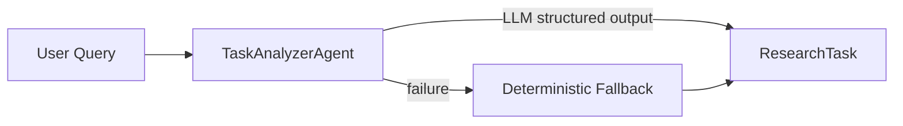

# Step 3 — TaskAnalyzerAgent

## Goal

Implement an independent `TaskAnalyzerAgent` that converts one natural-language research query into the typed `ResearchTask` contract from Step 2.

## Files Added

- `app/agents/research_task_analyzer.py`
- `tests/test_research_task_analyzer.py`
- `scripts/demo_task_analyzer.py`
- `REFACTOR_STEP3.md`

## Files Modified

None.

## TaskAnalyzer Input

`analyze(query: str)` accepts one non-empty research query.

## TaskAnalyzer Output

A validated `ResearchTask` with a UUID-based `research-task-...` ID, task classification, explicit entities, focused research questions, expected source types, and comparison/multiple-source flags.

## LLM Path

The injected client receives a dedicated system prompt and user query through the existing `AiMessage` contract. Text output is locally reduced to a JSON object and validated with `ResearchTask.model_validate()`.

## Fallback Path

Provider, timeout, JSON, or schema failures produce a deterministic valid `ResearchTask`. Paper-plus-repository analysis takes precedence, followed by explicit comparison, lightweight multi-hop signals, and fact lookup.

## Tests

Tests cover fact lookup, comparison invariants, paper/repository analysis, fenced/prefixed JSON, invalid JSON fallback, provider failure fallback, empty input, and unique task IDs.

## Runtime Wiring

**NOT YET.** The analyzer does not depend on Blackboard, Coordinator, Runtime, Harness, RAG, database, Redis, MCP, or the chat API.
