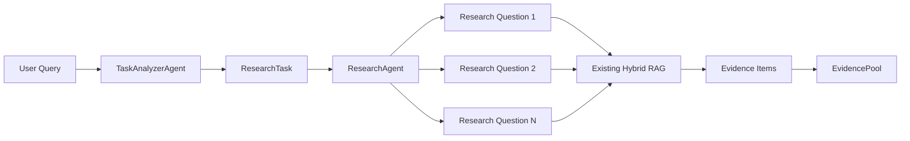

# Step 4 — ResearchAgent + EvidencePool

## Goal

Add an independent ResearchAgent adapter that converts a typed `ResearchTask` into an `EvidencePool` through the existing hybrid retrieval service.

## Existing RAG Reused

`ResearchAgent` calls the injected `KnowledgeService.retrieve(query, top_k)` API. Chroma retrieval, BM25, score fusion, local reranking, fallback behavior, and neighboring-chunk expansion remain owned by the existing service and are unchanged.

## ResearchAgent Interface

```python
ResearchAgent(knowledge_service, top_k=8, max_evidence_items=12)
    .research(task, retrieval_round=1) -> EvidencePool
```

The agent does not create database sessions, vector clients, embedding clients, artifacts, or final answers.

## Query Strategy

Use up to four non-empty, distinct `research_questions`. If none exist, use `task.query`. No additional LLM query rewrite occurs.

## Knowledge Result → Evidence Mapping

The existing `SearchResult` fields map as follows:

- `source` → `source_id` and `source_title`
- `chunk_id` → string `chunk_id`
- final retrieval `score` → `score`
- expanded `content` → `content`
- the originating research question → `query_used`
- unavailable section metadata → `None`
- a conservative filename heuristic → `ResearchSourceType`, otherwise `OTHER`

## Deduplication Strategy

Stable evidence IDs use `source:chunk_id`, or a deterministic SHA-256 content digest when no chunk ID exists. A round-robin merge lets each successful query contribute before later-ranked results. `EvidencePool.add()` remains the single deduplication mechanism, preserving the first `query_used`.

## Failure Handling

A failed query is logged and skipped. Other queries continue. If all queries fail or return no results, the agent returns an empty `EvidencePool`; it never fabricates evidence.

## Tests

Offline tests use a fake service returning the real `SearchResult` shape. Coverage includes fact lookup, comparison coverage, deduplication, limits, partial/all failure, query fallback, retrieval rounds, deterministic IDs, and the four-query guard.

## Architecture



Evidence verification not implemented yet.

## Runtime Wiring

**NOT YET.** The ResearchAgent is not registered with Blackboard, Coordinator, Harness, API, or the existing runtime.
